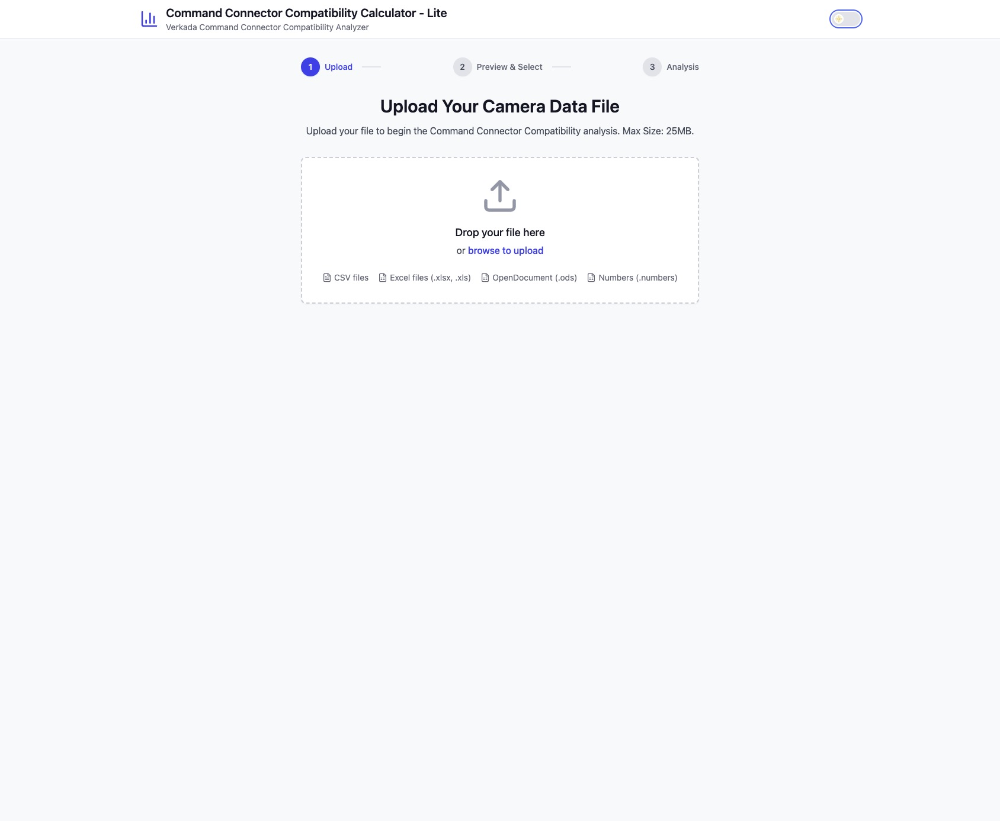
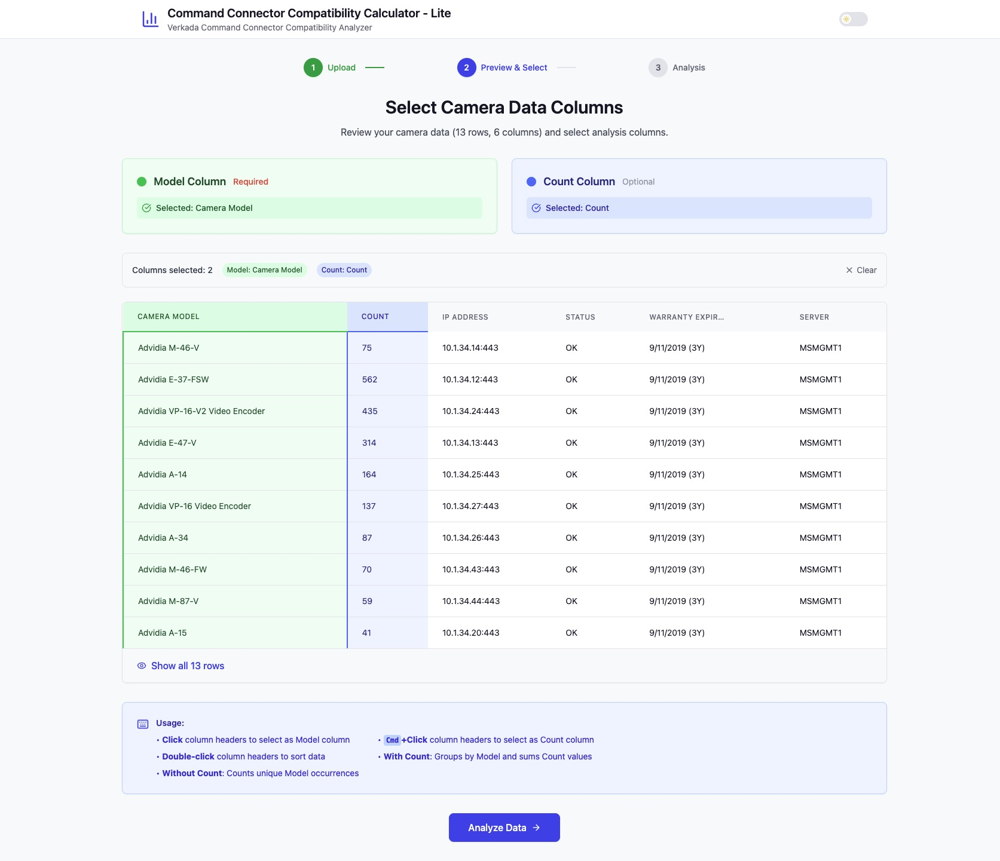

# Command Connector Compatibility Calculator - Lite

## Overview

Welcome to the Command Connector Compatibility Calculator\! This tool is designed to help you quickly and easily analyze your camera inventory against Verkada's official Command Connector Hardware Compatibility List.

By simply uploading a file with your camera models, this application automates the entire process of checking for compatibility. It cleans your data, matches it against thousands of compatible models, and provides you with a clear, interactive report. The goal is to save you time and effort in determining which of your existing security cameras can be integrated with Verkada's Command Connector.

**This is a web-based tool. No installation or setup is required.**

-----

-----

## How to Use the Calculator

The process is broken down into three simple steps: Upload, Preview, and Analysis.

### Step 1: Upload Your Camera File

First, you'll need a file containing a list of your camera models.

1.  Navigate to the application's homepage.
2.  Drag and drop your camera inventory file into the designated area, or click the box to browse for the file on your computer.
3.  The application supports several common formats: **CSV**, **Excel** (`.xlsx`, `.xls`), **OpenDocument** (`.ods`), and **Apple Numbers** (`.numbers`).
4.  Once uploaded, the tool will automatically validate and parse your file to proceed to the next step.

### Step 2: Preview Your Data & Select Columns

Next, you'll see a preview of your data. Here, you need to tell the application which columns to use for the analysis.

1.  **Select Model Column (Required):** Click on the header of the column that contains your camera model names. This column will be highlighted in green.
2.  **Select Count Column (Optional):** If you have a column that specifies the quantity of each camera model, hold `Cmd` (on Mac) or `Ctrl` (on Windows) and click that column's header. It will be highlighted in blue.
      * If you select a **Count** column, the tool will group identical models and sum their quantities.
      * If you don't select a **Count** column, the tool will simply count how many times each unique model appears in your list.
3.  Once you've selected the **Model Column**, the "Analyze Data" button will become active. Click it to continue.

### Step 3: Review and Manage Your Results

This is the final step, where you can see the full compatibility report.

1.  **Review the Summary:** At the top, you'll see a summary of the analysis, including the total number of unique models and a breakdown of matches.
2.  **Clear Potential Matches:** For any "Potential" matches, you can use the action buttons (✔️ to approve, ✖️ to decline) to confirm their match.
3.  **Review Camera Details:** Click the expand icon (`>`) next to a camera to see more details, like firmware requirements and compatibility notes.
4.  **Advanced Review:** Any cameras marked as 'Observed' have previously been seen and would usually already have the Resolution (MP) and Channel Count. For any other cameras, you can click the "Edit" (pencil) icon to manually modify its details, such as integration type, resolution, channel count or even the model name.
5.  **Export Your Report:** Once you're finished, you can download your results.

[!TIP]
If you encounter cameras that are not marked as 'Observed' or have incorrect information, when you edit these cameras with the appropriate Resolution(MP) and Channel count, you will see a 'Export Modified' button on the top, you can export the modified configuration as a YAML and share it with me and I can have it added to the gold standard configuration database.

-----

*\
[Screenshot Placeholder: The analysis results page, showing the summary cards and the main results table with different match types.]\</p\>*

-----

## Understanding the Match Types

The analysis results are categorized to give you a clear understanding of your inventory's compatibility.

| Icon | Match Type | Description |
| :--: | :--- | :--- |
| 🟢 | **Exact** | A direct, 100% match was found in the Verkada Hardware Compatibility List. |
| 🟡 | **Potential** | A close, similarity-based match was found. This requires your review and approval (or denial) to confirm. |
| 🔵 | **Identified** | A "Potential" match that you have manually approved. |
| 🟠 | **Declined** | A "Potential" match that you have manually declined. |
| 🟣 | **Modified** | You have manually edited the details for this camera entry. |
| 🔴 | **None** | No compatible model was found in the Verkada list. |
| 👁️ | **Observed** | An "Observed" tag indicates that the camera's specifications (like resolution or protocol type) have been enhanced using an additional third-party database for more detailed information. |

## Key Features

  * **Automatic Data Cleaning:** Your uploaded data is automatically cleaned to improve matching accuracy. The tool removes irrelevant information like IP addresses, MAC addresses, dates, and common words (e.g., "camera," "outdoor").
  * **Intelligent Matching:** The application uses a sophisticated algorithm (Levenshtein distance) to find not only exact matches but also potential ones, catching variations in model names.
  * **Third-Party Enhancement:** Unmatched cameras are cross-referenced against a separate database of known third-party cameras to provide additional details, helping you better identify and manage them.
  * **Interactive Editing:** You have full control to review and modify the results. You can approve or decline potential matches and edit camera details directly in the results table.

-----

*\
[Screenshot Placeholder: The camera editing form, showing the fields a user can modify.]\</p\>*

-----

## Exporting Your Results

You have two options for exporting your data:

1.  **Download Compatibility Report (CSV):** This downloads a complete report of your analysis in a CSV file. It includes the original model name, the matched model, match type, compatibility details, and any notes.
2.  **Export Modified (YAML):** This option becomes available only after you have modified at least one camera entry. It exports a `YAML` file containing *only the cameras you have edited*. This file is formatted for easy integration with other database systems.

## Frequently Asked Questions

**Q: Is my data secure?**
A: Yes. All file processing and data analysis happen **locally in your web browser**. Your data is never uploaded to an external server, ensuring your privacy and security.

**Q: What file formats are supported?**
A: You can upload files in CSV, Excel (`.xlsx`, `.xls`), OpenDocument (`.ods`), and Apple Numbers (`.numbers`) formats. The file size limit is 25MB.

**Q: Why was my camera model name changed in the results?**
A: The application automatically cleans your data for better matching accuracy. This involves removing extra information like IP/MAC addresses, dates, and common descriptive words. The original model name you provided is still visible for reference.

**Q: How accurate is the compatibility matching?**
A: **Exact** matches are 100% accurate based on the Verkada list. **Potential** matches use a similarity algorithm to find likely matches and require your confirmation to ensure accuracy.

**Q: Can I use this tool offline?**
A: The application requires an internet connection to load initially. However, all file processing happens in your browser, so you can perform the analysis without a persistent connection after the page has loaded.

-----

*Version: 1.0.0*